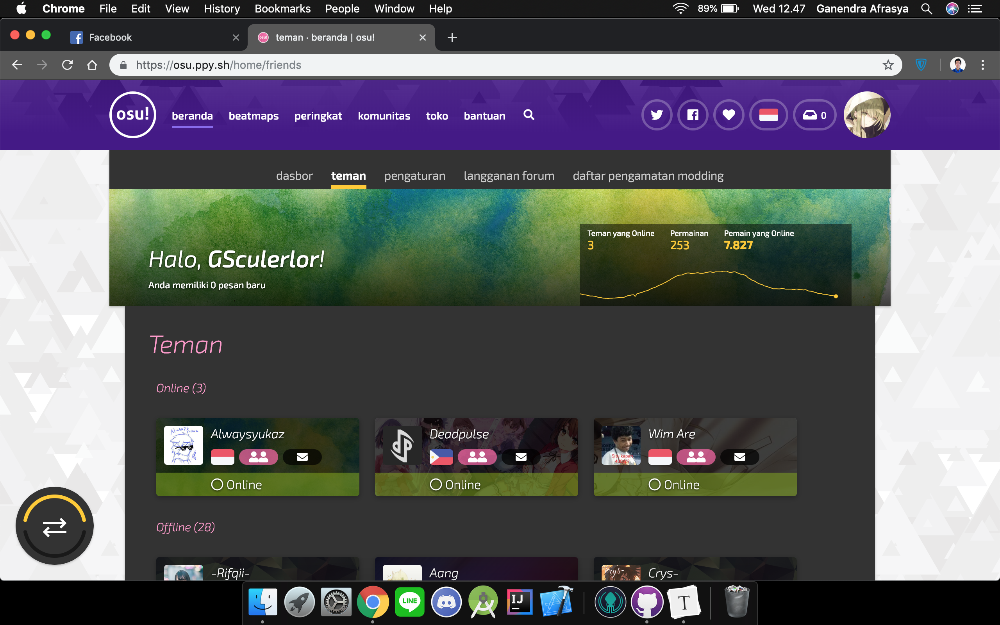
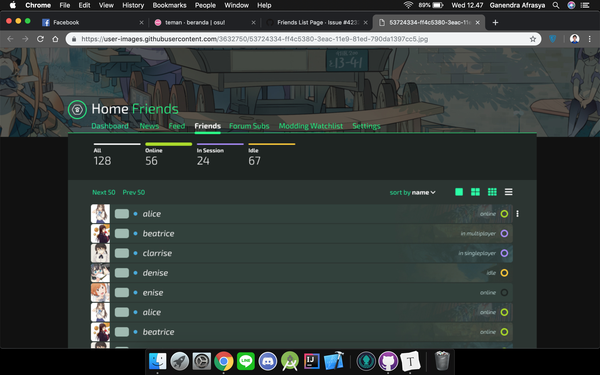

# Contextual Inquiry and Analysis
## osu! Web Description
[osu-web](https://github.com/ppy/osu-web) is one of [osu!](https://osu.ppy.sh/) open source project from osu!dev. This is the web portion of osu!. In-case you don't know about osu! feel free to [check this out](https://osu.ppy.sh/help/wiki/Welcome). Since it's open source project and it's on transition phase between [old page](https://old.ppy.sh/) to new page, and new page with new design language created by [flyte](https://osu.ppy.sh/users/3103765), lot of page and design is neither half-implemented nor not follow the new design language. The design itself is almost the same with the current design of the game, [osu!lazer](https://github.com/ppy/osu). There're two current active design language that implemented and under-development. Here's the example

## Instruction Script

- Open osu! webpage
- Login and then open profile page
- Try to search one of beatmap link that want to open 
- Go to the beatmap page
- Go to beatmap discussion page (moddingv2)
- Go back to beatmap page without explicitly go back using browser back button

## User Description
- Female, ~21 years old
- Costume Design student at LaSalle Collage
- Formerly an osu! player
- Familiar with old osu! Webpage, but not with the current webpage

## Transcript
Interdum et malesuada fames ac ante ipsum primis in faucibus. Suspendisse auctor, nunc non gravida maximus, nisl dui lobortis mi, ut maximus ipsum arcu eu quam. Etiam euismod lacus rhoncus lectus dapibus, nec maximus lorem porttitor. Nunc finibus dictum vehicula. Maecenas feugiat turpis vitae maximus placerat. Nunc quis neque vestibulum, rhoncus libero vel, efficitur diam. Donec lobortis turpis condimentum ultrices finibus. Sed sit amet eleifend sapien, non tristique felis. Suspendisse potenti. Maecenas sodales ac dolor ac suscipit. Aenean turpis arcu, placerat et augue vel, lacinia tincidunt ante. Etiam rhoncus nisl vitae sem rhoncus ultrices. Praesent venenatis vulputate diam, iaculis fringilla nisi. Nullam a tellus eget ipsum volutpat mattis fringilla non erat. Donec tincidunt mi sed metus vulputate tristique. Nam in dolor ut ex vestibulum rhoncus in nec lectus.
## Models and Annotations
### Artifact Model

### Flow Model

### Cultural Model

## Do's and Don't's
Fusce lobortis massa mauris, in aliquam erat aliquet eget. Donec rhoncus venenatis mauris, at commodo odio bibendum ac. Sed consectetur enim justo, vitae maximus eros elementum non. Sed feugiat orci sem, vel faucibus sem aliquet sed. Praesent pulvinar felis eget nisl varius, id lacinia urna pretium. Sed at ornare diam, nec fringilla dolor. In ut gravida sapien, eget varius magna. Morbi lobortis ex eu eleifend finibus. Phasellus eget nulla ullamcorper, ullamcorper purus ac, luctus turpis. Sed volutpat mauris ut erat consectetur, in sagittis erat egestas.
