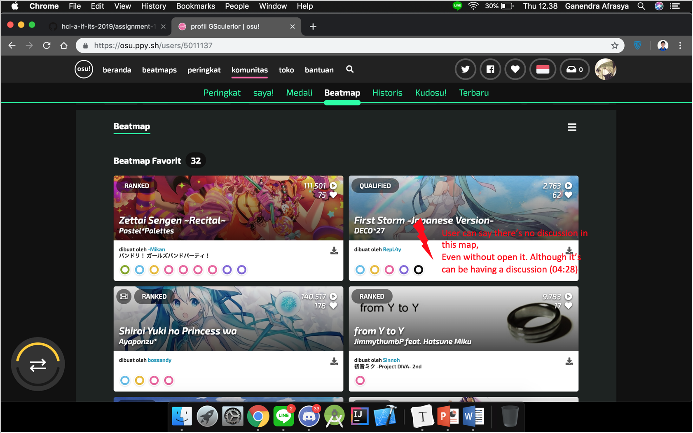
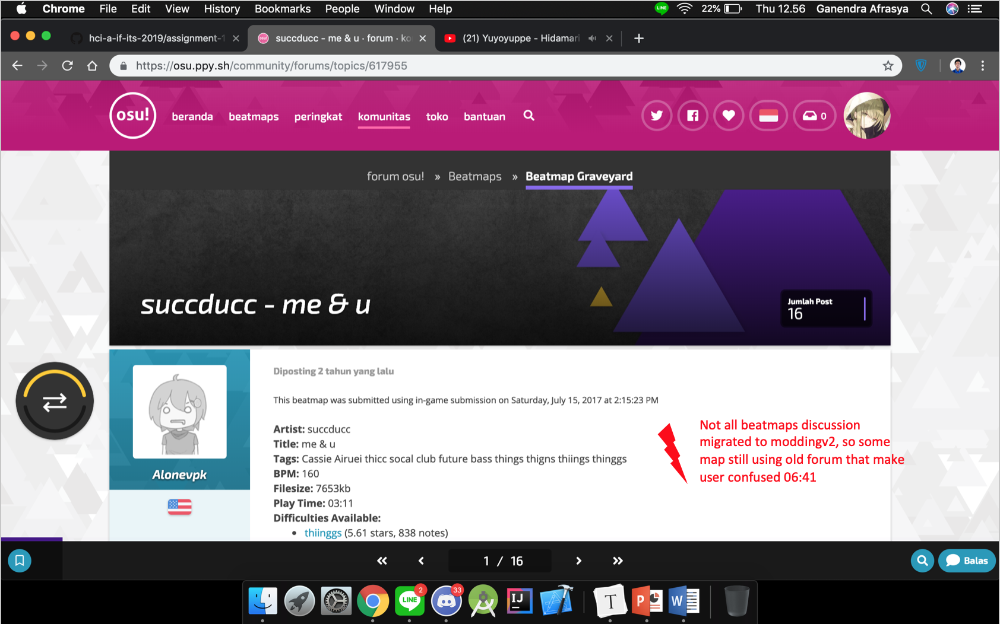
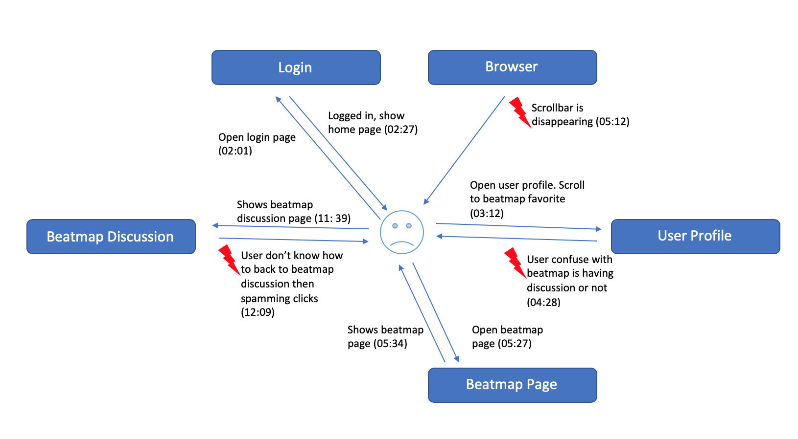
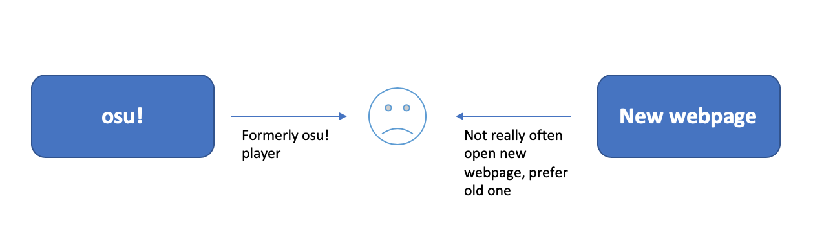

# Contextual Inquiry and Analysis
## osu! Web Description
[osu-web](https://github.com/ppy/osu-web) is one of [osu!](https://osu.ppy.sh/) open source project from osu!dev. This is the web portion of osu!. In-case you don't know about osu! feel free to [check this out](https://osu.ppy.sh/help/wiki/Welcome). Since it's open source project and it's on transition phase between [old page](https://old.ppy.sh/) to new page, and new page with new design language created by [flyte](https://osu.ppy.sh/users/3103765), lot of page and design is neither half-implemented nor not follow the new design language. The design itself is almost the same with the current design of the game, [osu!lazer](https://github.com/ppy/osu). There're two current active design language that implemented and under-development. Here's the example


## Instruction Script

- Open osu! webpage
- Login and then open profile page
- Try to search one of beatmap link that want to open 
- Go to the beatmap page
- Go to beatmap discussion page (moddingv2)
- Go back to beatmap page without explicitly go back using browser back button

## User Description

- Male, ~21 years old
- Universitas Airlangga student
- Formerly an osu! player and one of top player mania Indonesia
- Familiar with old osu! Webpage, but not with the current webpage

## Transcript
```
👌🏼: User tester
🤟🏼: Me
Disclaimer: This may contain lot (almost everything) of unnecessary dialogue, so bear with it
---------------------------------------------------------------------------------------------

👌🏼: Aku ngomong opo iki?
🤟🏼: Yo terserah, bahasa opo ae bebas
👌🏼: Terus mbok apakno iki?
🤟🏼: Tak gawe transkrip ngkok. Wes coba login o.
👌🏼: Iki kudu nggawe web anyar?
🤟🏼: Yo emang iku tujuan e, nggawe web anyar
👌🏼: Yaudah login, iki pake akun temenku *buka menu profil*
👌🏼: Wow terakhir maen 25 days ago, eazy 250 pp
🤟🏼: Eh aku pp rework onok 2 200 pp akhir e
👌🏼: Aku pisan onok 400 pp, eh 397 pp nanggung map santa san +HR *scroll ke bagian most played beatmap*
👌🏼: Ya ini map-map kesukaan akib, tapi gaada diskusinya jadi jangan
🤟🏼: Nyari map baru yang ada diskusinya
👌🏼: Yang ini, eh nggak ada ini. Tak buka akunku sing liyo *membuka page search*
👌🏼: Oh iyo iki *mencari akun bsbsatria*
🤟🏼: Oh yang juara IRT ya gan?
👌🏼: Juara 2 gara gara maen ndek rumah e mas cahyo. Nah iki sing 397 pp
🤟🏼: Nanggung anjir
👌🏼: Iki kok ilang sih scrollbar e 
🤟🏼: Iku tekan web osu e btw
👌🏼: Iyo ilang, ada map favorit *scroll ke bagian favorite beatmap*
🤟🏼: Eh map e helblinde enak btw, iso tak HR
👌🏼: Iyo enak *memilih map me & u - succducc*
👌🏼: Terus milih discussion *membuka page discussion beatmap*
👌🏼: Lah ini map lama, gaada discussionnya. Terus gimana?
🤟🏼: Nyari yang baru ae
👌🏼: Yaudah kita ke beatmap listing
🤟🏼: Hahaha, nyari map bagus nyari map bagus
👌🏼: Ini, yowes iki ae *memilih salah satu map random*
🤟🏼: Map opo iki gak jelas 
👌🏼: Loh apik iki lagu e enak. Wes discussion discussion. Nah ini *membuka page discussion beatmap*
👌🏼: Ini di diffnya Grey *scrolling ke bawah mencari button*, udah terus gimana ini?
🤟🏼: Nah gak ngerti penting iso mbalik maneh
👌🏼: *spamming click dimana-mana* Oh kalo nggak salah disini *spamming click di tab osu*
👌🏼: Kok gaiso
🤟🏼: Nah yo iku
👌🏼: *masih mencari sampai beberapa menit*
🤟🏼: Inti e kudu balik nang beatmap page e
👌🏼: *spamming click sampai ke kena map title* Nah oh iku
🤟🏼: Nah udah ketemu
👌🏼: Nah sip
```


## Models and Annotations
### Artifact Model





### Flow Model


### Cultural Model

## Do's and Don't's
Fusce lobortis massa mauris, in aliquam erat aliquet eget. Donec rhoncus venenatis mauris, at commodo odio bibendum ac. Sed consectetur enim justo, vitae maximus eros elementum non. Sed feugiat orci sem, vel faucibus sem aliquet sed. Praesent pulvinar felis eget nisl varius, id lacinia urna pretium. Sed at ornare diam, nec fringilla dolor. In ut gravida sapien, eget varius magna. Morbi lobortis ex eu eleifend finibus. Phasellus eget nulla ullamcorper, ullamcorper purus ac, luctus turpis. Sed volutpat mauris ut erat consectetur, in sagittis erat egestas.
